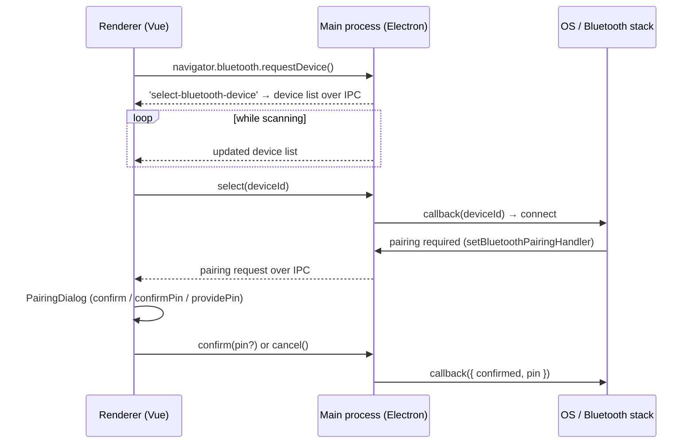

# electron-ble-pairing

Minimal **Electron + Vite + Vue (TypeScript)** demo focused on one feature:
**BLE pairing with a custom PIN / confirmation dialog.**

## How it works



- [electron/main.ts](electron/main.ts) — registers the pairing handler and the
  device-selection hook, bridges both over IPC.
- [electron/preload.ts](electron/preload.ts) — exposes the typed `window.bleApi`
  bridge (context-isolated).
- [src/composables/useBlePairing.ts](src/composables/useBlePairing.ts) — tracks
  pairing requests reactively; `confirm(pin?)` / `cancel()` answer them.
- [src/composables/useBleScan.ts](src/composables/useBleScan.ts) — scanning and
  device selection.
- [src/components/PairingDialog.vue](src/components/PairingDialog.vue) — modal
  handling all three pairing kinds: `confirm`, `confirmPin`, `providePin`.

## Run

```sh
npm install
npm run dev
```

## Test peripheral (Raspberry Pi)

[peripheral/ble_peripheral.py](peripheral/ble_peripheral.py) turns a Raspberry
Pi into a BLE peripheral named **TestDevice** with a pairing-protected GATT
characteristic (LE passkeys
are kernel-generated per spec and get logged by the script).

```sh
sudo apt install python3-dbus python3-gi
sudo python3 peripheral/ble_peripheral.py
```

Scan with the Electron app, select "TestDevice", and enter the passkey from
the Pi's log when the pairing dialog appears. To re-test pairing, remove the
bond on the Pi first: `bluetoothctl remove <central-mac>`.

## How to reproduce the pairing issue

1. Start the BLE peripheral on the Raspberry Pi using `sudo python3 peripheral/ble_peripheral.py`.
2. Open the Electron app and start scanning for devices.
3. Select "TestDevice" from the list.
4. When the pairing dialog appears, enter the passkey displayed in the Pi's log.
5. Disconnect the device from the Electron app.
6. Remove the bond information using Windows Settings
7. Re-scan and select "TestDevice" again to initiate a new pairing attempt. _The pairing dialog won't appear._
